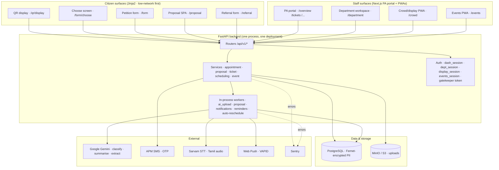
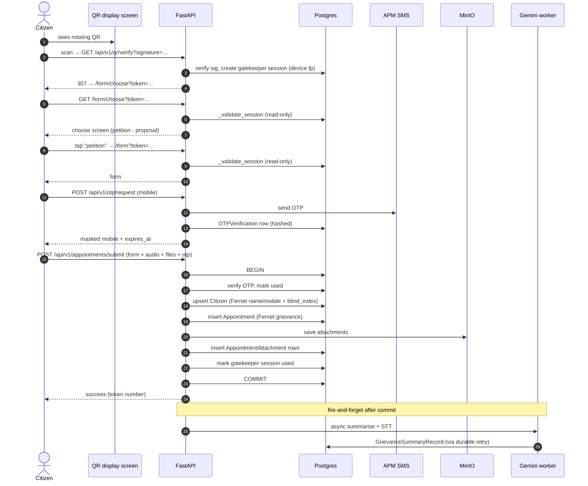
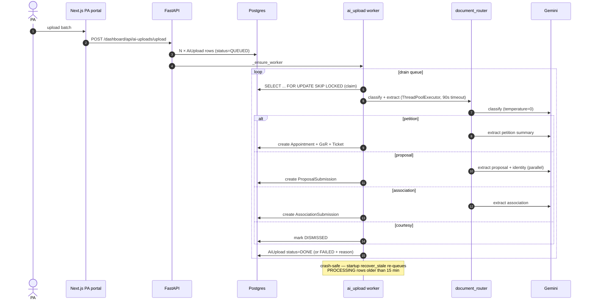
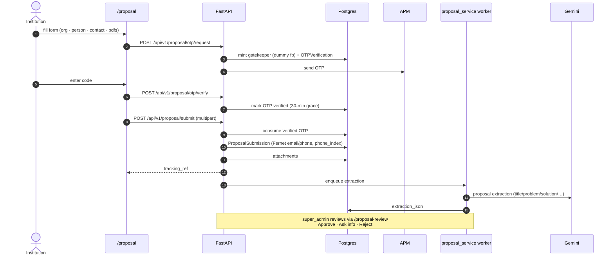
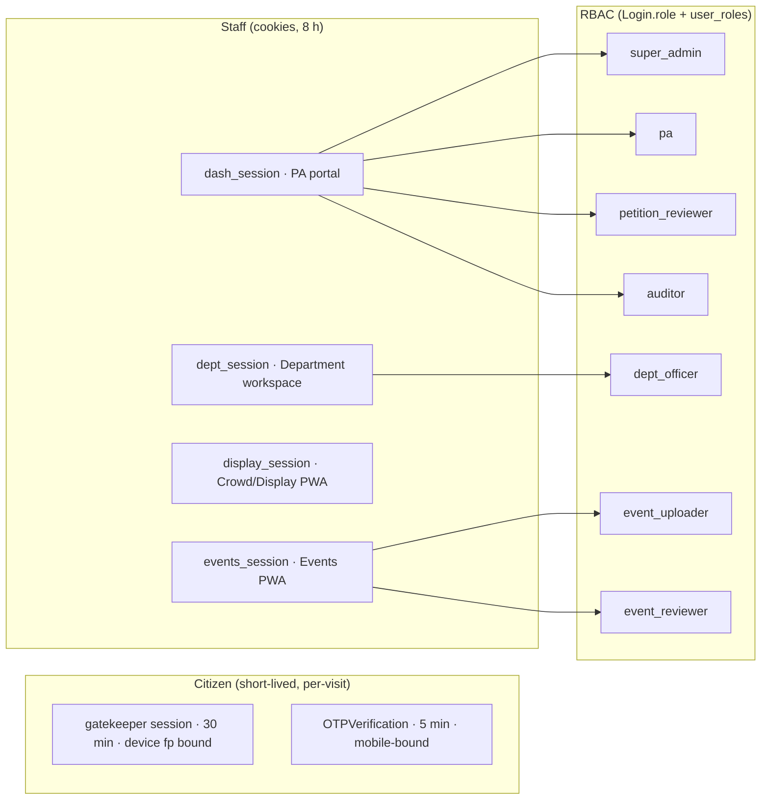
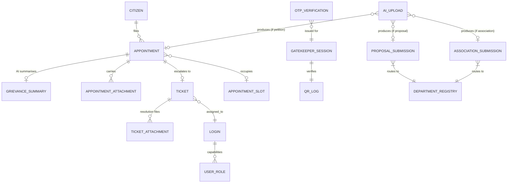

# NamKural — Production Go-Live Review & System Design

**Audience:** engineering + PA-office ops taking over support and maintenance
**Author:** end-to-end backend audit, 2026-08-03
**Scope:** every route, service, worker, model, migration, external integration, config surface. Vertex AI plumbing in `backend/src/services/petition_extraction.py` and `backend/src/core/config.py` reviewed only structurally per instruction — dedicated audit lives with that owner.

The system is broadly production-shaped: real encryption for PII, durable AI workers with crash recovery, per-model Gemini fallback, RBAC, an ASGI middleware carefully written to avoid a real race, and considered health probes. The findings below are the deltas between "works today" and "runs safely for months without the engineers who built it".

Read the P0 section before any deploy. The rest is prioritised so the maintenance team can burn it down over the first 30 days post-launch.

---

## 1. Executive summary

| Bucket | Count | Meaning |
|---|---|---|
| **P0 — go-live blockers** | 7 | Security or data-integrity holes that must close before or at deploy. Every one is a small code change; the risk is *shipping without noticing*. |
| **P1 — must fix within 2 weeks** | 11 | Won't stop launch but will bite in month one — silent failure paths, unbounded fan-out, deprecated APIs, missing tests around irreversible operations. |
| **P2 — before handoff** | 8 | Support-ergonomic gaps (logging, tracing, runbooks, CI) — the team taking over will hit these first. |
| **Optimizations** | 6 | Nothing broken; wins under load. |
| **Alternative approaches** | 5 | Strategic bets that would meaningfully change the shape of ops. |

---

## 2. P0 — Go-live blockers

### P0-1. `POST /petition/scan/submit` is unauthenticated but writes citizen PII
File: [backend/src/api/v1/scan_petition.py:34](../backend/src/api/v1/scan_petition.py#L34)

The route docstring claims "protected by dash_session cookie" but the endpoint has **no** `Depends(require_auth)`. Anyone reachable at `POST /petition/scan/submit` creates a full Citizen + Appointment + Ticket row from arbitrary input, and fires a Gemini extraction spend against your billing account. The `GET /petition/scan` upload page is likewise open.

**Fix:** add `Depends(require_auth)` and require at minimum `role in {pa, super_admin}`. Then either productionize the page (add CSRF, tighten file validation) or move it behind a feature flag.

### P0-2. Default staff credentials hardcoded in config
File: [backend/src/core/config.py:98–110](../backend/src/core/config.py#L98)

`DASHBOARD_USERNAME=admin` / `DASHBOARD_PASSWORD=admin123`, same story for display and events. If a prod deploy is ever missing a value in `.env`, the entire dashboard is publicly reachable with the world's most-guessed credentials. Pydantic won't complain — the defaults just resolve.

**Fix:** promote each of these six to **required** fields (no default, no `Optional`). The app will refuse to start without them — which is the correct behaviour.

### P0-3. OTPs returned in JSON body + logged in plaintext when APM key missing
File: [backend/src/services/appointment_service.py:497–534](../backend/src/services/appointment_service.py#L497)

When `APM_SMS_API_KEY` is unset, the code enters "dummy mode": it generates the OTP locally, `logger.info`'s it in plaintext, and returns it in the HTTP response as `otp_code`. In dev this is a nice affordance; if it ever runs in prod (missing env var, key rotated wrong) it broadcasts every OTP to any caller. Rate limits are 3/min, so an attacker can enumerate mobile numbers cheaply.

**Fix:** gate dummy mode on `settings.DEBUG` (or a dedicated `ALLOW_DUMMY_OTP` flag). In non-DEBUG, either raise or return a generic 502; never leak the code. Same pattern in `create_open_otp_request` (used by /proposal).

### P0-4. `ENCRYPTION_KEY` silently falls back to `SECRET_KEY`
File: [backend/src/core/crypto.py:40–47](../backend/src/core/crypto.py#L40)

Comment acknowledges the risk. In production, rotating `SECRET_KEY` (a normal ops action — session invalidation, credential compromise response) will permanently corrupt every Fernet-encrypted column. There is no way to recover.

**Fix:** in non-DEBUG, require `ENCRYPTION_KEY` and raise on missing. Add a startup check: derive the Fernet, encrypt+decrypt a known plaintext, refuse to start if it fails.

### P0-5. Passwords stored as HMAC-SHA256, not bcrypt/argon2
Files: [backend/src/models/login_models.py:47–53](../backend/src/models/login_models.py#L47), [backend/src/models/department_account.py:19](../backend/src/models/department_account.py#L19)

`hmac.new(SECRET_KEY, password, sha256)` is (a) fast — enables GPU brute force — (b) unsalted per-user, so identical passwords produce identical hashes (rainbow tables), (c) locked to `SECRET_KEY`, so rotating the key breaks every login.

**Fix:** switch to `argon2-cffi` (or `bcrypt` at cost 12) — one hour of work. The migration path is well-worn:
- Add a nullable `password_argon2` column.
- On next successful login (which verifies the old HMAC), silently rehash + write to `password_argon2` + null the HMAC column.
- Once no HMAC rows remain (a metric), drop the old column.

### P0-6. `RATE_LIMIT_ENABLED=False` by default
File: [backend/src/core/config.py:38–41](../backend/src/core/config.py#L38)

`@limiter.limit(...)` decorators are correctly placed on OTP request/verify and login endpoints, but they no-op unless this flag flips on. There's no smoke test that would catch a missing env override. Combined with P0-3 (dummy-mode OTP leak), this is a credential-stuffing gateway.

**Fix:** flip the default to `True`. Rate limiting off should be the explicit opt-in for dev.

### P0-7. Next.js rewrite gap for `/api/v1/otp/*` and `/api/v1/appointments/*`
File: [PA portal/frontend/next.config.mjs:42–63](../PA%20portal/frontend/next.config.mjs#L42)

The rewrites cover `/api/v1/proposal|scheduling|referral|admin|me|features|departments|admin`, but the citizen appointment flow in [backend/src/api/v1/appointments.py](../backend/src/api/v1/appointments.py) mounts under `/api/v1` (bare). If any React surface (PA portal, future citizen SPA) calls `/api/v1/otp/request` or `/api/v1/appointments/submit`, the generic `/api/*` rule rewrites it to `/dashboard/api/*` → 404. Today these are only reached via the Jinja2 form directly on FastAPI, so nothing user-visible breaks; a future PR that calls those endpoints from React will silently fail.

**Fix:** either move the appointments router under an unambiguous prefix (`/api/v1/appointments`), or add explicit rewrites for `/api/v1/otp/*` and `/api/v1/appointments/*` to the config now, before the mistake is made.

---

## 3. P1 — Fix within two weeks of launch

### P1-1. Silent-swallow `except Exception: pass` (214 occurrences)
Notable clusters:
- [backend/src/services/stt_service.py:61–62, 73–74, 371–372, 388–389](../backend/src/services/stt_service.py#L61) — five silent excepts in the STT path; a Sarvam auth failure could look like a "no transcript" outcome forever.
- [backend/src/services/ai_upload_service.py:783–784](../backend/src/services/ai_upload_service.py#L783)
- [backend/src/services/scheduling_service.py:502–503](../backend/src/services/scheduling_service.py#L502)

Nothing reaches Sentry. Ops has no signal.

**Fix:** every `except:` at the very least `logger.exception(...)` and, if the operation is not idempotent, re-raise. Set up a lint rule (ruff `BLE001` or `E722`) and remove the bare-except pattern.

### P1-2. Orphaned startup task loops with no shutdown hook
Files: [backend/src/main.py:272](../backend/src/main.py#L272) (auto-reschedule), [backend/src/main.py:305](../backend/src/main.py#L305) (courtesy STT drain)

Both use `_asyncio.create_task(_loop())` without keeping the returned handle. On SIGTERM the loops cancel mid-`asyncio.sleep`, either raising `CancelledError` traces into logs (noise) or leaking an open DB session that never gets returned to the pool. The reminder scheduler at :202 already does this correctly — copy that shape.

**Fix:** retain the task handle at module level, register a `@app.on_event("shutdown")` that sets a stop-event and `await asyncio.wait_for(task, timeout=5)`.

### P1-3. `document_router` per-request `ThreadPoolExecutor`
File: [backend/src/services/document_router.py:69](../backend/src/services/document_router.py#L69)

`with ThreadPoolExecutor(max_workers=2)` is created and torn down per call. Under bulk AI-upload load, N concurrent requests spawn N × 2 threads, and each thread synchronously blocks a Gemini call — no global cap, no queue, no back-pressure.

**Fix:** module-level executor + a bounded `asyncio.Semaphore(N)` sizing concurrent Gemini spend. Or lift both extractions onto asyncio directly and drop threads entirely (google-genai has async support).

### P1-4. `event_service.process_event` fan-out is unbounded
File: [backend/src/services/event_service.py:314, 542, 941](../backend/src/services/event_service.py#L314)

Each photo fires an `asyncio.create_task(process_event(...))` with no bound. A batch upload of 30 invitation cards = 30 concurrent Gemini calls, hitting the tier's RPS ceiling and racking up cost.

**Fix:** feed uploads into an `asyncio.Queue` drained by a fixed pool of workers, or use the same durable-worker pattern `ai_upload_service` uses.

### P1-5. `datetime.utcnow()` — 114 occurrences across 32 files
Deprecated in Python 3.12, and returns *naive* datetimes. The auto-reschedule loop mixes `datetime.now()` (server-local) with UTC comparisons elsewhere; the events reminder scheduler juggles naive UTC vs IST. Any timezone bug here is silent and only surfaces at scale (missed reminders, wrong-day sweeps).

**Fix:** codebase-wide replace with `datetime.now(timezone.utc)`. Add a `datetime`-import ruff rule to prevent regressions.

### P1-6. Zero test coverage on auth surfaces and the atomic submit
`backend/tests/` has 82 lines of pure-logic tests and QR unit tests only. Nothing covers:
- `dash_auth` / `dept_auth` / `display_auth` / `events_auth` — no test asserts that an unauth request is rejected.
- `POST /appointments/submit` — the only workflow that atomically creates Citizen + Appointment + OTP + Attachment. Break it and CI stays green.
- `require_super_admin`, `require_feature_superadmin_ui`.
- Worker `recover_stale` semantics.

**Fix:** three test files, ~200 lines total:
1. `test_auth.py` — for each router: unauth GET/POST → 401/403. Wrong-role → 403.
2. `test_submit_atomic.py` — happy path + rollback assertion (raise inside `process_manual_petition`, verify no Citizen row created).
3. `test_worker_lifecycle.py` — queue → claim → recover_stale semantics with a fake Gemini.

### P1-7. `GrievanceSummaryRecord.name_en/name_ta` stored plaintext
File: [backend/src/models/grievance_summary_record.py](../backend/src/models/grievance_summary_record.py)

`Citizen.encrypted_name` is Fernet. The AI summary record for the same person stores the same name plaintext. If your PII posture demands encryption on the citizen table, the summary table needs it too — otherwise a read of `grievance_summary_records` bypasses your protection.

**Fix:** either encrypt these two columns and add a matching `_index` for lookup, or explicitly document why the summary copy is exempt (e.g. it's already redacted, or scoped by AI to safe values). Right now the code just does the wrong thing quietly.

### P1-8. `proposal_service` worker has no per-call Gemini timeout
File: [backend/src/services/proposal_service.py](../backend/src/services/proposal_service.py)

`ai_upload_service._worker` wraps each Gemini call in `asyncio.wait_for(..., timeout=90)`; the proposal worker relies only on the Gemini SDK's own timeouts. On a slow Gemini call the worker stalls and blocks the queue indefinitely.

**Fix:** copy the `wait_for` pattern verbatim.

### P1-9. `SERVER_BASE_URL` fallback to `request.base_url` is Host-injection
Files: [backend/src/api/v1/qr.py:68](../backend/src/api/v1/qr.py#L68), [backend/src/api/v1/dashboard.py:28](../backend/src/api/v1/dashboard.py#L28), [backend/src/api/v1/referral.py:44](../backend/src/api/v1/referral.py#L44)

When `SERVER_BASE_URL == "http://localhost:8000"` (the default), these routes fall back to `request.base_url`, which is derived from the `Host` header. An attacker sending `Host: evil.example.com` gets a QR code that points at `evil.example.com`. In prod this only matters if the env var is not set — but the default *is* localhost, so a missing override activates it.

**Fix:** in non-DEBUG, require `SERVER_BASE_URL` and refuse to start without it. Never fall back to `request.base_url` in prod paths.

### P1-10. Storage `boto3` blocking calls inconsistently offloaded
File: [backend/src/services/storage_service.py](../backend/src/services/storage_service.py)

The dashboard file server correctly wraps `save_file` in `asyncio.to_thread`. Several other callers (some in `proposal_service`, some in ticket resolve) don't. Blocking boto3 inside async handlers stalls the event loop under load.

**Fix:** make the service async at the boundary — expose only awaitable methods that internally use `asyncio.to_thread`. Then callers can't forget.

### P1-11. Password-reset flow returns plaintext initial password
File: [backend/src/api/v1/admin.py](../backend/src/api/v1/admin.py) — every dept-account create/reset returns `{initial_password: "..."}` for one-shot display.

Design is intentional (super admin needs to hand it to the dept), but the reveal is one-shot in the UI, one-shot in the API — meaning it lives in nginx access logs (if `?password=` were ever used) or app logs if anything ever `logger.info`'s the response body. Currently nothing does, but this is a landmine for a future "let me log the response for debugging" PR.

**Fix:** add a lint/audit rule that response bodies from `/api/v1/admin/*` never enter logs, and consider issuing a signed one-time reveal URL rather than putting the plaintext in the JSON.

---

## 4. P2 — Before handoff

- **In-memory rate limiter.** `slowapi` counts live in-process. A restart resets the window; multi-worker deploys break the counter. Move to Redis-backed storage before you scale horizontally.
- **No structured logs.** Everything is `logger.info("free text")`. Grepping for a specific case in Sentry / Papertrail is painful. Adopt `structlog` and emit `{event, request_id, actor, resource_id, latency_ms}`.
- **No request ID propagation.** Add a middleware that stamps `X-Request-ID` on every response, and thread it through log records + external calls. Ops will thank you.
- **Readiness probe doesn't check Gemini/MinIO.** `/health/ready` verifies DB only. If Gemini quota is exhausted, the pod stays "ready" while every submission fails. Add optional dependency checks with short timeouts.
- **No CI/CD pipeline surfaced.** No `.github/workflows/`. Test + lint + type-check need to run on every PR before the team you're handing off to trusts merges.
- **No backup / restore runbook.** Postgres backups (WAL archiving / point-in-time-restore), Fernet key custody, MinIO bucket snapshots. Document all three in `docs/`.
- **Ticket priority as `VARCHAR(20)`.** [Migration 031](../backend/alembic/versions/031_widen_ticket_priority.py) widened it to hold `"critical"`. That's fine, but it's actually an enum — invalid values only surface at read time. Add a CHECK constraint or a lookup table.
- **Two `TODO`s in code** — [appointments.py:413](../backend/src/api/v1/appointments.py#L413) (placeholder endpoint returning `{"message":"to be implemented"}`), [appointment_service.py:294](../backend/src/services/appointment_service.py#L294). Address or delete.

---

## 5. Optimizations (not broken, wins under load)

1. **Analytics query indexes.** Dashboard analytics filter by `(status, created_at, category, ministry, district, priority)` combinations. Confirm composite indexes match hot filter shapes; the current per-column indexes may not be used for multi-predicate queries.
2. **Connection pool sizing.** `AsyncSessionLocal` — expose `pool_size` + `max_overflow` via env vars; today's defaults may not match your worker count.
3. **`admin_lookup` cache with TTL / invalidation.** Loaded once at startup; if an admin changes a category via Settings, the running process still sees the stale value. Add a lightweight refresh trigger or 5-minute TTL.
4. **Bounded global Gemini semaphore.** Each service governs its own concurrency (or doesn't — see P1-3 and P1-4). A single process-wide `Semaphore(N)` around every Gemini call, sized by paid tier, prevents burst-quota loss.
5. **Cost tracking on Gemini calls.** Emit a metric `{model, service, tokens_in, tokens_out}` per call to a StatsD/OTel sink. Finance will ask; better to have it than build it retroactively.
6. **N+1 audit on the tickets list.** [dashboard_service.py](../backend/src/services/dashboard_service.py) ticket list — verify the assigned_to/citizen joins are eager (`selectinload`), not lazy per row.

---

## 6. Alternative approaches worth considering

**A. Replace in-process durable workers with a real queue (Arq/RQ/Celery).**
Today: `ai_upload_service._worker` and `proposal_service._worker` run inside the FastAPI process. They're crash-recoverable (nice) but can't scale horizontally without duplicating work. A single Arq worker on Redis (or Celery on rabbit) gives you: multi-machine scale, retries with jitter, dead-letter queue, and a UI to inspect state. The rewrite is small — the durable-claim pattern maps 1:1 to `arq.WorkerSettings`.

**B. Structured logging + OpenTelemetry.**
Ops taking over a system they didn't build will spend most of their time reading logs. Structured logs + distributed tracing (auto-instrument FastAPI + SQLAlchemy + httpx) makes "why did petition #1234 take 12s?" a five-minute question instead of a five-hour dig. Sentry + Grafana Cloud / Honeycomb cover this cheaply.

**C. Move rate limiter to Redis.**
Blocks horizontal scale today. `slowapi` supports Redis storage — one config line.

**D. Outbound notification event bus.**
`notification_service.*` is currently `pass` / log-only. The design intent is clearly "SMS/WhatsApp on every status change" (the fire-and-forget `_notify` calls exist). If you decide to wire this up, do it once as an outbound event bus (e.g. Redis Streams or a `notifications` table + worker) rather than adding blocking SMS/WhatsApp calls to every write path — otherwise a Twilio outage takes the dashboard down.

**E. Adopt `argon2-cffi` for passwords immediately (see P0-5).**
Also worth: password-strength enforcement, per-user salt (comes free with argon2), and a "must rotate on next login" flag for the seeded admin accounts.

---

## 7. System design

### 7.1 High-level architecture

### 7.2 Petition intake (walk-in via QR)

### 7.3 AI Upload pipeline (bulk PDF → tickets)

### 7.4 Proposal intake (public form + OTP)

### 7.5 Auth & session boundaries

Confirmed: no cookie is shared across surfaces. Each PWA has its own `require_*` gate. QR gatekeeper is validated read-only for the choose screen so it can also gate the form without consuming the token.

### 7.6 Data model (core entities)

Encrypted (Fernet) columns are labelled `encrypted_*`; blind indexes (`_index`) hold HMAC-SHA256 of the same value for equality lookup.

---

## 8. Support & maintenance handoff

### 8.1 The first hour on call
1. **Is the process alive?** `curl https://namkural.in/health` → `{"status":"healthy"}`.
2. **Is DB reachable?** `curl https://namkural.in/health/ready` → `{"status":"ready"}`.
3. **Is Gemini working?** Look at Sentry for `RuntimeError("Gemini failed on all models …")` in the last 15 min — that's a Gemini outage or quota kill. Fallback chain is 2.5-flash → 2.5-flash-lite → 2.0-flash; if all three fail simultaneously, it's you, not them.
4. **Are workers draining?** DB: `SELECT status, count(*) FROM ai_uploads WHERE created_at > now() - interval '1 hour' GROUP BY 1;` — if `QUEUED` or `PROCESSING` is growing, the worker died. Restart the pod.
5. **Are OTPs going out?** Sentry for `_send_otp_sms` failures. APM SMS side: their dashboard.

### 8.2 Routine tasks
- **Adding a department:** Super Admin → Settings → Dept Accounts → add. Flows through to the ticket assign dropdown via `/api/v1/departments` (DB-backed since 2026-08-03).
- **Password reset:** super admin → Settings → user → reset → hand plaintext initial password to the user in person / secure channel. They must change it on first login (not yet enforced — see P2).
- **Category retag:** Categories live in the `admin_lookup` cache (in-process). Change in DB, restart the pod. Fix in P2.
- **Rotating APM SMS key:** set `APM_SMS_API_KEY` in env, redeploy. Dummy-mode fallback is a P0 hazard (see P0-3) — fix that before rotating in prod.

### 8.3 Emergency runbook — corrupt / lost data
- **Fernet key lost.** All `encrypted_*` PII becomes unreadable. There is **no recovery.** Backups are only useful if you restore both the DB and the key from the same point in time. Never rotate `SECRET_KEY` in prod until P0-4 is fixed.
- **DB rollback needed.** Migrations are all `down_revision`-linked and idempotent. `alembic downgrade -1` works. Verify against a staging clone first — some migrations do backfills you can't undo cheaply (011, 013 for citizen mobile).
- **QR display offline.** The screen page auto-retries every 5s (see [qr_display.jinja2:474](../backend/templates/qr_display.jinja2#L474)). If it stays broken, `/api/v1/qr/generate?venue_id=main_office` from any browser is your smoke check.

### 8.4 What to monitor (recommended alerts)
| Signal | Threshold | Reaction |
|---|---|---|
| p95 latency of `POST /appointments/submit` | > 5s over 5min | Investigate — usually Storage/MinIO or Gemini |
| Rate of `ai_uploads.status='FAILED'` | > 20% over 1h | Gemini outage or malformed batch |
| Rate of `_send_otp_sms` HTTP 502 | any spike | APM SMS outage or key expired |
| `gatekeeper` row count | > 100k | pruning stopped — check maintenance loop |
| `datetime.utcnow` deprecation warning | any | you finally started fixing P1-5 |
| Sentry unhandled | any P0 tag | actual bug — investigate |

---

## 9. Prioritised 30-day plan

| Week | Deliverable | Files |
|---|---|---|
| **Pre-launch (48h)** | Close all 7 P0s. Add `test_auth.py` covering the fixes. | Config, crypto, appointment_service, scan_petition, login_models, next.config.mjs |
| **Week 1** | P1-1 (bare-excepts), P1-2 (loop shutdowns), P1-5 (`datetime.utcnow`), P1-8 (proposal timeout), P1-9 (Host injection) | Services + main.py |
| **Week 2** | P1-3, P1-4 (Gemini concurrency), P1-6 (auth tests), P1-10 (storage async boundary) | document_router, event_service, storage_service, tests |
| **Week 3** | P1-7 (encrypt GsR names), P1-11 (password reveal audit); start P2-2 (structured logs) + P2-3 (request IDs) | grievance_summary_record migration, logging_config |
| **Week 4** | P2-1 Redis rate limiter, P2-4 richer health check, P2-5 CI pipeline, P2-6 backup runbook | infra + docs |

Anything not on this list is either working correctly or already tracked in the code review above.

---

## Appendix A — Files not deep-reviewed
- `backend/src/services/petition_extraction.py` and `backend/src/core/config.py` Vertex block — per instruction; belongs to a separate audit.
- `PA portal/frontend/*` — treated as a consumer of the backend contract; a UI-level review is a separate deliverable.
- Sarvam STT internals (`stt_service.py` lines 61–90, 371–390) — flagged in P1-1 but a full behaviour audit is a separate task if you plan to change STT vendor.

## Appendix B — What I explicitly verified vs. inferred
- **Verified with file reads:** every P0. Line numbers reflect what's on disk now.
- **Inferred from grep/inventory:** the 214-count of `except:` blocks, the 114-count of `datetime.utcnow` occurrences, and cluster-flagged files under P1-1 and P1-5. Investigate each cluster with `git blame` before mass-refactoring.
